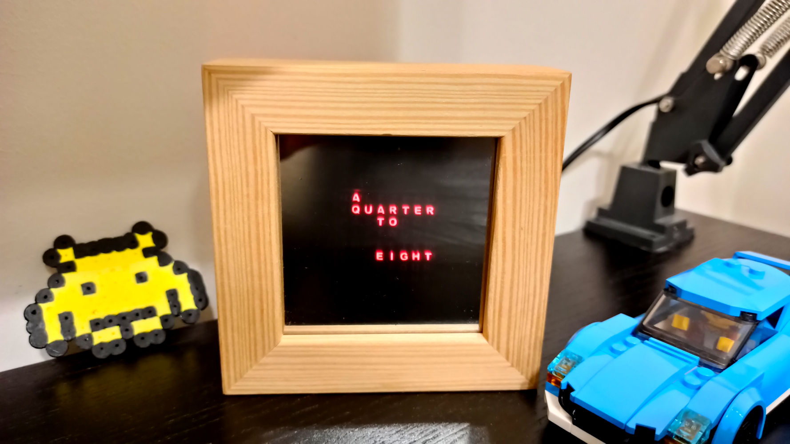
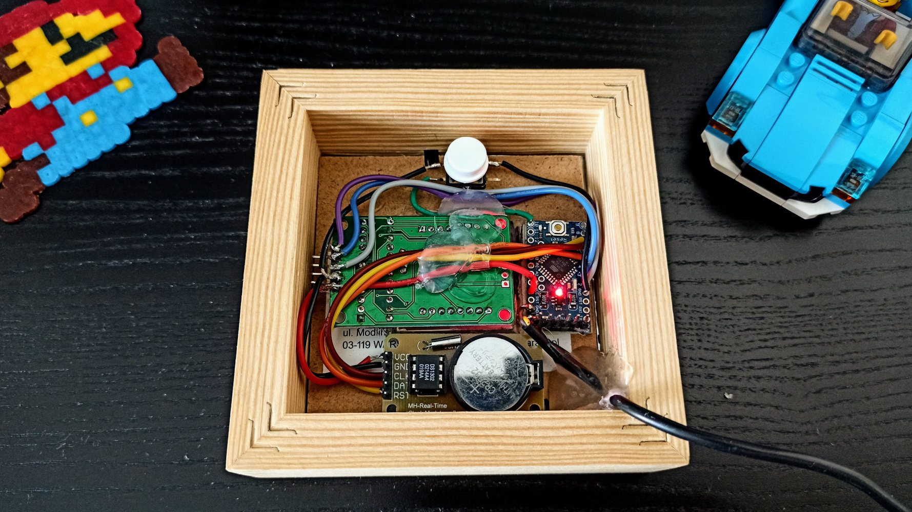

# Wordclock

Arduino wordclock.

## Parts used

* Arduino Pro Mini
* 8x8 LED matrix module with an integrated MAX72xx led driver chip
* RTC clock module with battery -- to not reset the time on power loss
* 5V power adapter -- I reused a old phone charger
* a momentary pushbutton -- for setting the time
* a 8 x 8 cm picture frame -- enclosure
* mirror window film -- for the mirror effect
* wordclock pattern printed on paper

## How it works

The 8x8 LED matrix is controlled by the Arduino to light up the right pixels according to the layout of the
[letter matrix](matrix.txt).  The LED matrix pixels are round dots, so to display letters, a [mask is used](mask.svg).
It's printed on paper with colors inverted (letters are white, background is black).  Its size matches the matrix size
when printed and cut out.  It's attached to the matrix using transparent tape.

All electronics is hidden inside a wooden picture frame.  The frame is small, but bigger than the matrix, so a square
hole is cut in the back of the frame.  The led matrix is glued to the rest of the picture frame so that only the
matrix with the mask is visible from the front side of the frame.

Finally, a mirror film is put on the glass of the frame.  This way the surface looks like a mirror with only the lit
letters visible.

## Pictures

